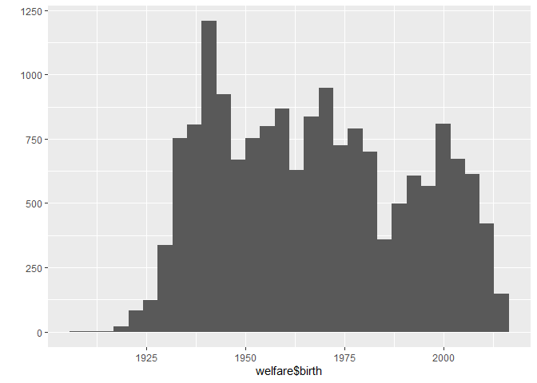

한국인의 삶의 이해 ‘복지패널데이터’
================
조해슬
July 30, 2020

## 3\. 나이와 월급의 관계

나이게 따라 월급이 어떻게 다른지 데이터 분석을 통해 알아보자. 먼저 나이 변수를 검토하고 전처리한다. 월급 변수 전처리는 앞
실습에서 완료했으니 생략하고 변수 간 관계를 분석한다.

### 분석 절차

#### 1\. 변수 검토하기

나이와 월급의 관계를 분석하려면 나이 변수가 있어야 한다. 한국복지패널데이터에는 나이 변수는 없고 태어난 연도 변수만 있기 때문에
태어난 연도를 이용해서 나이 변수를 만들어야 한다. 먼저 태어난 연도 변수를 검토한 후 나이 변수를 만든다.

``` r
class(welfare$birth)
```

    ## [1] "numeric"

``` r
summary(welfare$birth)
```

    ##    Min. 1st Qu.  Median    Mean 3rd Qu.    Max. 
    ##    1907    1946    1966    1968    1988    2014

``` r
qplot(welfare$birth)
```

    ## `stat_bin()` using `bins = 30`. Pick better value with `binwidth`.

<!-- -->

#### 2\. 전처리

코드북을 보면 태어난 연도는 1900\~2014 사이의 값을 지니고, 모름/무응답은 9999로 코딩되어 있다. 이 정보를 바탕으로
전처리 작업을 한다.

``` r
#이상치 확인
summary(welfare$birth)
```

    ##    Min. 1st Qu.  Median    Mean 3rd Qu.    Max. 
    ##    1907    1946    1966    1968    1988    2014

``` r
#결측치 확인
table(is.na(welfare$birth))
```

    ## 
    ## FALSE 
    ## 16664

출력된 결과를 보면 이상치와 결측치가 없다. 따라서 파생변수를 만드는 단계로 넘어가면 된다.

#### 3\. 파생변수 만들기 - 나이

태어난 연도 변수를 이용해 나이 변수를 만든다. 2015년에 조사가 진행됐으니 2015에서 태어난 연도를 뺀 후 1을 더해 나이를
구한다. 변수를 만들고 summary() qplot()을 이용해 특징을 살펴본다.

``` r
welfare$age <- 2015 - welfare$birth +1
summary(welfare$age)
```

    ##    Min. 1st Qu.  Median    Mean 3rd Qu.    Max. 
    ##    2.00   28.00   50.00   48.43   70.00  109.00

``` r
qplot(welfare$age)
```

    ## `stat_bin()` using `bins = 30`. Pick better value with `binwidth`.

<!-- -->

### 나이와 월급의 관계 분석하기

나이와 월급 변수의 전처리 작업이 모두 끝났으니 이제 나이에 따른 월급을 분석할 차례다.

#### 1\. 나이에 따른 월급 평균표 만들기

``` r
age_income <- welfare %>% 
  filter(!is.na(income)) %>% 
  group_by(age) %>% 
  summarise(mean_income = mean(income))
```

    ## `summarise()` ungrouping output (override with `.groups` argument)

``` r
head(age_income)
```

    ## # A tibble: 6 x 2
    ##     age mean_income
    ##   <dbl>       <dbl>
    ## 1    20        121.
    ## 2    21        106.
    ## 3    22        130.
    ## 4    23        142.
    ## 5    24        134.
    ## 6    25        145.

#### 2\. 그래프 만들기

앞에서 만든 표를 이용해 그래프를 만든다. x축을 나이, y축을 월급으로 지정하고 나이에 따른 월급의 변화가 표현되도록 선
그래프를 만든다.

``` r
ggplot(data = age_income, aes(x=age, y=mean_income)) + geom_line()
```

<!-- -->

출력된 그래프를 보면 20대 초반에 100만 원가량의 월급을 받고, 이후 지속적으로 증가하는 추세를 보인다. 50대 무렵 300만
원 초반대로 가장 많은 월급을 받고, 그 이후로 지속적으로 감소하다가 70세 이후에는 20대보다 낮은 월급을 받는다.
