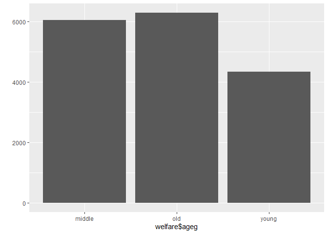
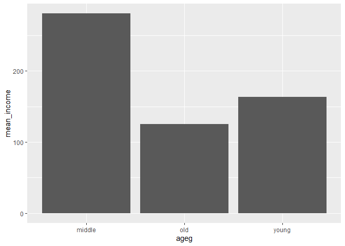

한국인의 삶의 이해 ‘복지패널데이터
================
조해슬
July 31, 2020

## 4\. 연령대에 따른 월급 차이

앞에서는 각 나이별 평균 월급을 분석했다. 이번에는 나이를 연령대로 분류해서 비교한다.

### 분석 절차

### 연령대 변수 검토 및 전처리하기

#### 1\. 파생변수 만들기 - 연령대

앞에서 만든 나이 변수를 이용해 연령대 변수를 만든다.

범주 기준 초년 30세 미만 중년 30\~59세 노년 60세 이상

``` r
welfare <- welfare %>% 
  mutate(ageg = ifelse(age<30, "young", ifelse(age<60, "middle", "old")))

table(welfare$ageg)
```

    ## 
    ## middle    old  young 
    ##   6049   6281   4334

``` r
qplot(welfare$ageg)
```

<!-- -->

### 연령대에 따른 월급 차이 분석하기

#### 1\. 연령대별 월급 평균표 만들기

연령대별로 평균 월급이 다른지 알아보기 위해 연령대별 월급 평균표를 만든다.

``` r
ageg_income <-welfare %>% 
  filter(!is.na(income)) %>% 
  group_by(ageg) %>% 
  summarise(mean_income = mean(income))
```

    ## `summarise()` ungrouping output (override with `.groups` argument)

``` r
ageg_income
```

#### 2\. 그래프 만들기

``` r
ggplot( data = ageg_income, aes(x=ageg, y=mean_income)) + geom_col()
```

<!-- -->

#### 막대 정렬 : 초년, 중년, 노년 나이 순

막대를 변수의 알파벳 순으로 정렬하도록 기본값이 설정되어 있다. 막대가 초년, 중년, 노년의 나이 순으로 정렬되도록 설정한다.

``` r
ggplot ( data=ageg_income, aes(x=ageg, y=mean_income)) + geom_col()+ scale_x_discrete(limits= c("young", "middle", "old"))
```

<!-- -->
