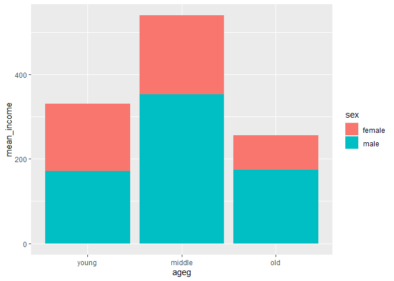
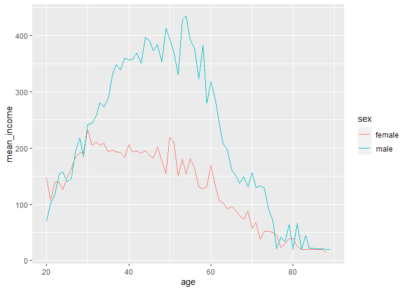

한국인의 삶의 이해 ‘복지패널데이터
================
조해슬
July 31, 2020

## 5\. 연령대 및 성별 월급 차이

성별 월급 차이는 연령대에 따라 다른 양상을 보일 수 있다. 이번에는 성별 월급 차이가 연령대에 따라 다른지 분석해본다. 연령대,
성별, 월급 변수 모두 앞에서 전처리 작업을 완료했으니 바로 변수 간 관계를 분석한다.

### 분석 절차

변수 검토 및 전처리 : 연령대, 성별, 월급

변수 간 관계 분석 : 연령대 및 성별 월급 평균표 만들기, 그래프 만들기

### 연령대 및 성별 월급 차이 분석하기

#### 1\. 연령대 및 성별 월급 평균표 만들기

각 연령대에서 성별에 따른 월급에 차이가 있는지 알아보기 위해 연령대 및 성별에 따른 월급 평균표를 만든다.

``` r
sex_income <- welfare %>% 
  filter(!is.na(income)) %>% 
  group_by(ageg, sex) %>% 
  summarise(mean_income = mean(income))
```

    ## `summarise()` regrouping output by 'ageg' (override with `.groups` argument)

``` r
sex_income
```

#### 2\. 그래프 만들기

앞에서 만든 표를 이용해 그래프를 만든다. 막대가 연령대별로 표현되도록 x축에 ageg를 지정한다. 막대가 성별에 따라 다른
색으로 표현되도록 fill에 sex를 지정한다. 축 순서는 scale\_x\_discrete(limits=c())를
이용해 연령대 순으로 설정한다.

``` r
ggplot( data = sex_income, aes(x=ageg, y=mean_income, fill=sex)) +
  geom_col() + 
  scale_x_discrete(limits=c("young", "middle", "old"))
```

<!-- -->

#### 성별 막대 분리

출력된 그래프는 각 성별의 월급이 연령대 막대에 함께 표현되어 있어 차이를 비교하기 어렵다. geom\_col()의
position 파라미터를 “dodge”로 설정해 막대를 분리한다.

``` r
ggplot(data= sex_income, aes(x=ageg, y=mean_income, fill = sex)) +  geom_col(position ="dodge") + scale_x_discrete(limits = c("young", "middle", "old"))
```

<!-- -->

### 나이 및 성별 월급 차이 분석하기

#### 그래프 만들기

이번에는 연령대로 구분하지 않고 나이 및 성별 월급 평균표를 만들어 그래프로 표현한다. 그래프는 선 그래프로 만들고, 월급 평균
선이 성별에 따라 다른 색으로 표현되도록 aes()의 col 파라미터에 sex를 지정한다.

``` r
# 성별 연령별 월급 평균표 만들기

sex_age <- welfare %>% 
  filter(!is.na(income)) %>% 
  group_by(age, sex) %>% 
  summarise( mean_income = mean(income))
```

    ## `summarise()` regrouping output by 'age' (override with `.groups` argument)

``` r
head(sex_age)

#그래프 만들기
ggplot( data=sex_age, aes(x=age, y=mean_income, col=sex)) + geom_line()
```

<!-- -->
